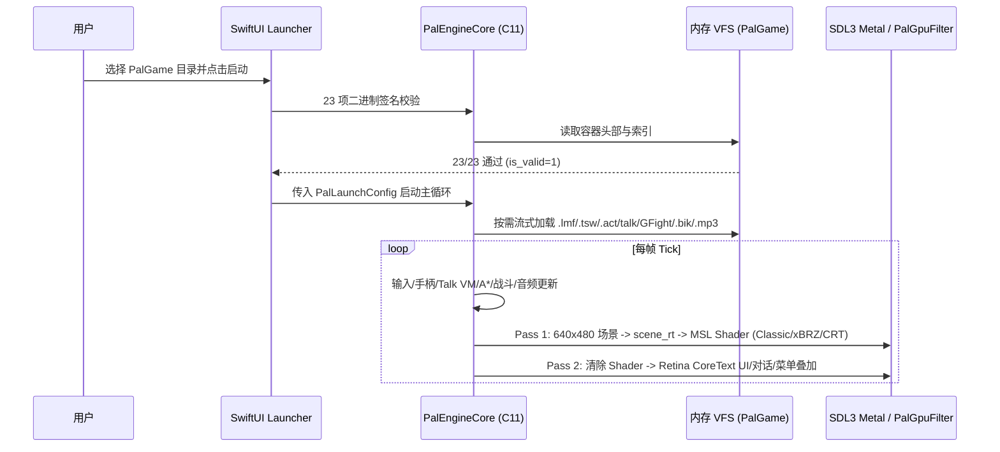
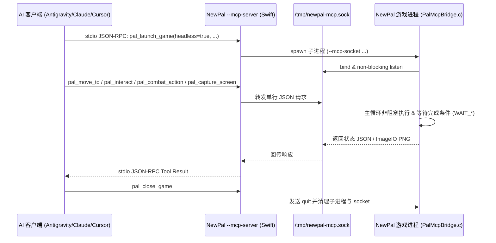

# Key flows

## 1. 常规游戏运行主链路（BYOD → Metal 两遍渲染）

```mermaid
sequenceDiagram
    participant U as 用户
    participant App as SwiftUI Launcher
    participant Core as PalEngineCore (C11)
    participant VFS as 内存 VFS (PalGame)
    participant GPU as SDL3 Metal / PalGpuFilter

    U->>App: 选择 PalGame 目录并点击启动
    App->>Core: 23 项二进制签名校验
    Core->>VFS: 读取容器头部与索引
    VFS-->>App: 23/23 通过 (is_valid=1)
    App->>Core: 传入 PalLaunchConfig 启动主循环
    Core->>VFS: 按需流式加载 .lmf/.tsw/.act/talk/GFight/.bik/.mp3
    loop 每帧 Tick
        Core->>Core: 输入/手柄/Talk VM/A*/战斗/音频更新
        Core->>GPU: Pass 1: 640x480 场景 -> scene_rt -> MSL Shader (Classic/xBRZ/CRT)
        Core->>GPU: Pass 2: 清除 Shader -> Retina CoreText UI/对话/菜单叠加
    end
```

## 2. MCP 自主游玩与验收链路

```mermaid
sequenceDiagram
    participant AI as AI 客户端 (Antigravity/Claude/Cursor)
    participant Host as NewPal --mcp-server (Swift)
    participant Sock as /tmp/newpal-mcp.sock
    participant Game as NewPal 游戏进程 (PalMcpBridge.c)

    AI->>Host: stdio JSON-RPC: pal_launch_game(headless=true, ...)
    Host->>Game: spawn 子进程 (--mcp-socket ...)
    Game->>Sock: bind & non-blocking listen
    AI->>Host: pal_move_to / pal_interact / pal_combat_action / pal_capture_screen
    Host->>Sock: 转发单行 JSON 请求
    Game->>Game: 主循环非阻塞执行 & 等待完成条件 (WAIT_*)
    Game-->>Sock: 返回状态 JSON / ImageIO PNG
    Sock-->>Host: 回传响应
    Host-->>AI: stdio JSON-RPC Tool Result
    AI->>Host: pal_close_game
    Host->>Game: 发送 quit 并清理子进程与 socket
```

相关详述：[[byod-clean-room-vfs]]、[[c11-core-and-sdl3-metal-pipeline]]、[[mcp-native-server-and-headless-playtest]]。
